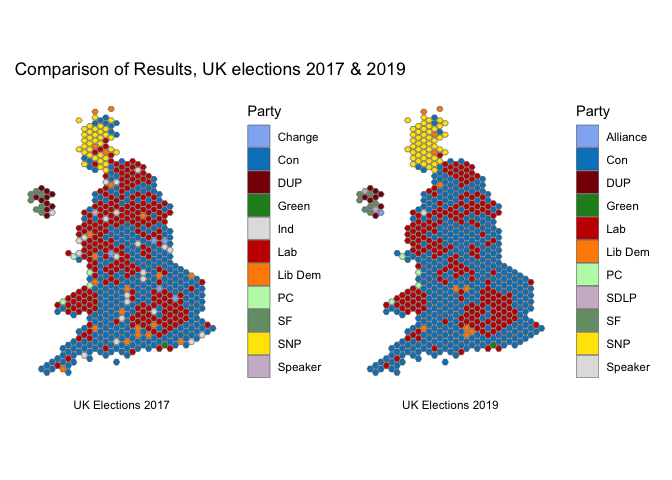

After the UK elections in 2017, I posted about how [easy it was to plot
the results in
R](https://www.robertmylesmcdonnell.com/content/posts/uk-elections-2017/).
Given that the UK just had another election, I thought I’d update that
post with another one. So here ya go.

What we'll do is make a plot of the results using R, and then we'll compare it to the last election using static plots and a GIF. You'll need to install the relevant packages below if you plan to try this out yourself.

The data for the results is hosted on my github, here we'll just read it in from there. The only other work pre-plotting is joining the results and the geographic data and combining some smaller parties into an "Other" category, which is not really necessary, but leaves the plot cleaner. Actually, most of the work is choosing the colours!!

```r
xfun::pkg_attach(c("jsonlite", "dplyr", "rnaturalearthhires", "sf", "parlitools", "ggplot2", "patchwork", "magick"))

res_file <- "https://raw.githubusercontent.com/RobertMyles/blogdata/master/results.json"
uk <- west_hex_map %>%
  select(ons = gss_code, geometry)

results <- fromJSON(res_file) %>%
  as_tibble() %>%
  full_join(uk) %>%
  select(-candidates) %>%
  st_as_sf() %>%
  mutate(
    party = case_when(
      winningParty %in% c("Speaker", "Green", "Alliance", "PC", "SDLP") ~ "Other",
      TRUE ~ winningParty
    )
  ) %>%
  filter(!is.na(party))

ggplot(results) +
  geom_sf(aes(fill = party), size = 0.2) +
  theme_minimal() +
  theme(axis.text = element_blank(),
        panel.grid = element_blank(),
        plot.title.position = "plot") +
  guides(fill = guide_legend(title = "Party")) +
  scale_fill_manual(values = c("#0084c6", "#880105", "#c70000",
                                "#ee6f00", "#888888", "#236925",
                                "#ffe500")) +
  ggtitle("UK Elections 2019")
```


Overwhelming rejection of Corbyn’s socialism, there.

With patchwork (recently CRANified, yay), we can compare 2017's winners with the winners this year:

```r
first <- ggplot(results) +
  geom_sf(aes(fill = sittingParty), size = 0.2) +
  theme_minimal() +
  theme(axis.text = element_blank(),
        panel.grid = element_blank(),
        plot.caption = element_text(hjust = 0.5)) +
  guides(fill = guide_legend(title = "Party")) +
  scale_fill_manual(values = c("#92B4F4", "#0084c6", "#880105",  "forestgreen",
                               "grey88", "#c70000", "darkorange", "#BDF7B7",
                              "#749C75", "#ffe500", "#CEBACF")) +
  labs(caption = "UK Elections 2017")

second <- ggplot(results) +
  geom_sf(aes(fill = winningParty), size = 0.2) +
  theme_minimal() +
  theme(axis.text = element_blank(),
        panel.grid = element_blank(),
        plot.caption = element_text(hjust = 0.5)) +
  guides(fill = guide_legend(title = "Party")) +
  scale_fill_manual(values = c("#92B4F4", "#0084c6", "#880105",  "forestgreen",
                               "#c70000", "darkorange", "#BDF7B7",
                               "#CEBACF",  "#749C75", "#ffe500", "grey88")) +
  labs(caption = "UK Elections 2019")

first + second + plot_annotation(title =  "Comparison of Results, UK elections 2017 & 2019")
```



We can really see the change in the so-called ['Red Wall'](https://www.theguardian.com/politics/2019/dec/13/bombastic-boris-johnson-wins-huge-majority-on-promise-to-get-brexit-done) that has given the Conservatives such a huge victory. Let's animate this change, because we can, y'allz. All we need to do is save the bare images and use the magick library to animate the images as a gif. The code is the following, but obviously you'll need to use your own paths and images.

```r
img1 <- image_read("images/img2019.png")
img2 <- image_read("images/img2017.png")
frames <- image_morph(c(img1, img2, img1), frames = 25)
image_animate(frames, fps = 10)
```


Until next UK election...
