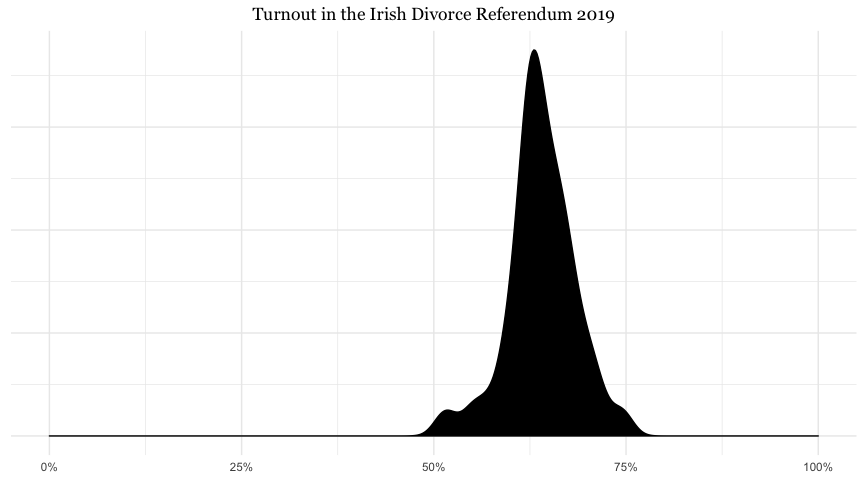
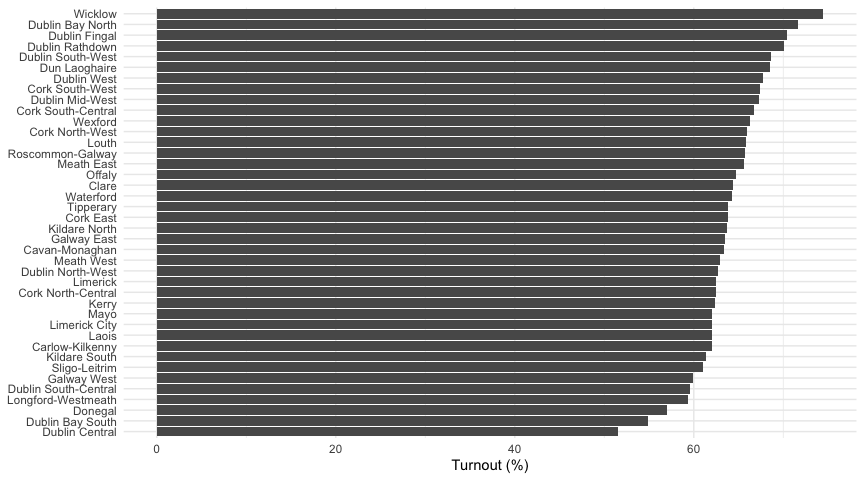
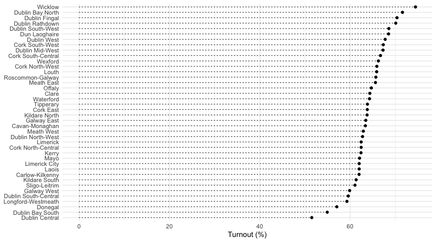
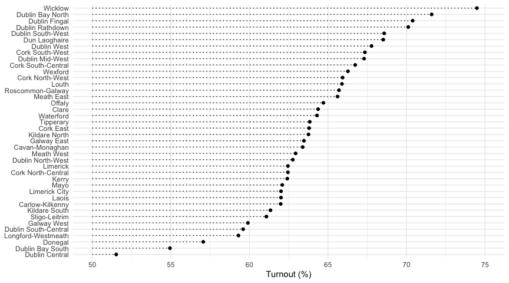
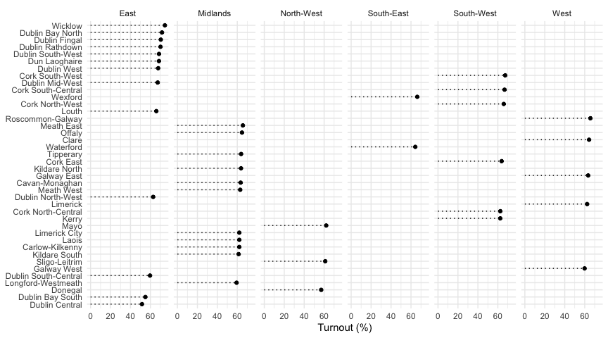
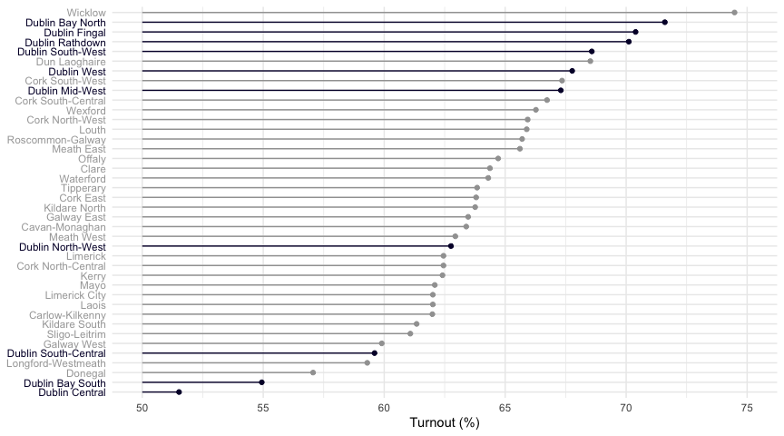
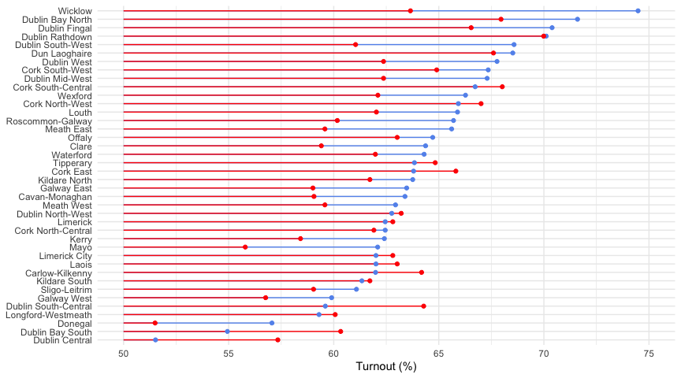
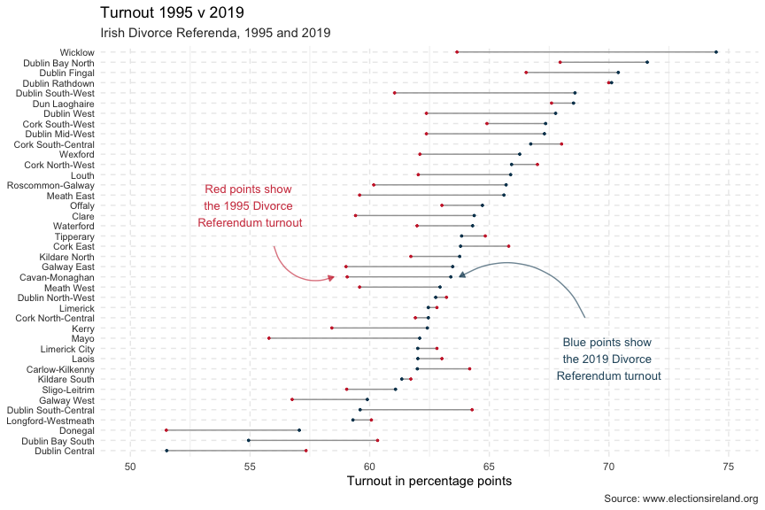
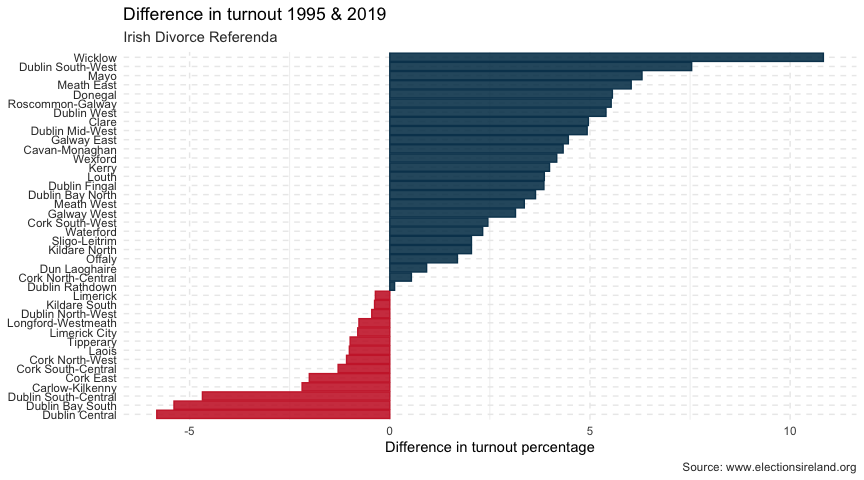
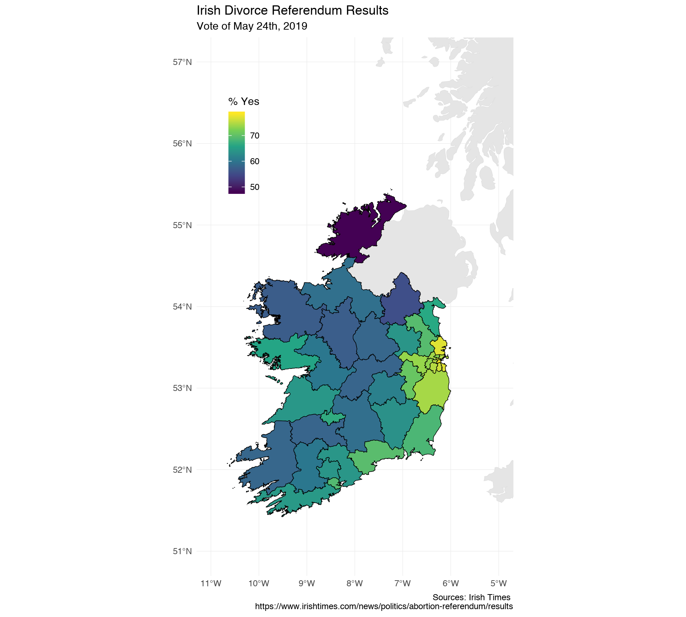

import SimpleBarChart from "../graphs/SimpleBarChart.js"
import data from "../data/divorceTurnout2019.json"

A while ago, I
[posted](https://www.robertmylesmcdonnell.com/content/posts/d3_in_MDX/)
about including D3 charts in MDX documents. I was pretty chuffed at my
little D3-React bar chart (with tooltips!), but that was mainly to do
with me being technically able to do it, not because it was a beautiful
piece of data visualization (it isn’t). In `$DAYJOB`, I’ve been thinking
more about dataviz and the science behind it, and along with a talented
colleague of mine, I’m preparing a data visualization guide for our data
science team. You’d think Data Scientists would be pretty well clued-in
on dataviz, but that’s not always the case. I thought I’d revisit my own
horrific dataviz crime and go through a step-by-step process of ways we
could improve it. Good data visualization is always about the
**message** you want to convey – what interests me in these data is the
overwhelming
[Yes](https://www.robertmylesmcdonnell.com/content/posts/divorce-ireland/)
vote, so that’s what I’ll be concentrating on highlighting. It’s also a
nice opportunity to highlight mistakes often made, and that I often make
when making dataviz without thinking too deeply about it.[^1] I suppose
one challenge we face here is that there is no external comparison – the
strong ‘Yes’ vote is not being compared to any previous referenda. We’ll
change that later on.

To remind you of what we’re talking about, here’s the chart I originally
posted:

<SimpleBarChart data={data} height={900} width={1080} />

### So what’s wrong with this?

Well, there are a couple of things that are not ideal with this chart.
First of all, it’s hard to compare exact numbers in the different
constituencies, although the tooltips help us to escape that a little
bit. Secondly, the bars are very visually dominant and your eye gets
drawn to their centre, and not to the right-hand side, which is where
the important information that the bars is trying to convey is found.
While the wall of bars does kind of convey the ‘overwhelming “Yes”’ that
I was trying to get at, I think there must be better ways, and we could
definitely think about the x-axis. Thirdly, although I like the colour
scale, it doesn’t really add much, if anything, to the chart.

There are some difficulties involved in plotting this dataset – mainly
that we have a lot of ‘categories’ (the constituencies, all 40 of them),
and that there is very little variation in the other variable of
interest, the turnout. To get an idea of what I mean, have a look at the
following plot, showing the spread of values of the turnout across the
constituencies:

I’ve left in the full x-axis to show the problem clearly – most of our
data falls in a pretty narrow range. The combination of these two
things, the thin spread across many categories, means it’s a good
dataset to explore visually, since the optimal solution is not
immediately apparent (to me, at least).

### Setup

I’m going to use R and ggplot2 for this exploration. The principles
we’ll explore are not tied to these tools, I just think they’re the best
available for what we need to do here. I’ll leave all the code in so
that anybody interested can copy and paste, but like I said, this is not
an R-specific exercise.

Let’s get our data and load the libraries we’ll use.

    library(readr)
    library(ggplot2)
    library(dplyr)
    library(glue)

    df <- read_csv("https://raw.githubusercontent.com/RobertMyles/blogdata/master/divorceRef2019turnout.csv")

This dataset looks like this (first 6 lines):

    df %>% head() %>% knitr::kable()

<table>
  <thead>
    <tr class="header">
      <th style="text-align: left;">Constituency</th>
      <th style="text-align: right;">Turnout</th>
    </tr>
  </thead>
  <tbody>
    <tr class="odd">
      <td style="text-align: left;">Carlow-Kilkenny</td>
      <td style="text-align: right;">61.99</td>
    </tr>
    <tr class="even">
      <td style="text-align: left;">Cavan-Monaghan</td>
      <td style="text-align: right;">63.39</td>
    </tr>
    <tr class="odd">
      <td style="text-align: left;">Clare</td>
      <td style="text-align: right;">64.37</td>
    </tr>
    <tr class="even">
      <td style="text-align: left;">Cork East</td>
      <td style="text-align: right;">63.80</td>
    </tr>
    <tr class="odd">
      <td style="text-align: left;">Cork North-Central</td>
      <td style="text-align: right;">62.45</td>
    </tr>
    <tr class="even">
      <td style="text-align: left;">Cork North-West</td>
      <td style="text-align: right;">65.93</td>
    </tr>
  </tbody>
</table>

### First attempts

So, like I did with D3, I suppose one of the first things you would do
with a dataset like this (assuming you want to plot both variables) is
to make some type of bar chart. Since we have long names for our
categories, the best option is a bar chart with the categories on the
y-axis. It’s standard practice to order the data for this type of chart,
so with all this we can make a simple naive attempt at visualizing this
dataset, which basically replicates our previous D3 implementation
(except no tooltips 😥).

    df %>%
      mutate(Constituency = forcats::fct_reorder(Constituency, Turnout)) %>%
      ggplot(aes(x = Constituency, y = Turnout)) +
      geom_col() +
      labs(x = NULL, y = "Turnout (%)") +
      coord_flip() +
      theme_minimal()

Wall o’bars again. We can reduce this effect by stripping out the bulk
of the bars.

    df %>%
      mutate(Constituency = forcats::fct_reorder(Constituency, Turnout)) %>%
      ggplot(aes(x = Turnout, y = Constituency)) +
      geom_point() +
      geom_segment(aes(y = Constituency, yend = Constituency, x = 0, xend = Turnout), linetype = 3) +
      labs(y = NULL, x = "Turnout (%)") +
      theme_minimal()

Ok, that solves our problem of a wall of dark-coloured bars. The dots
and the underlying grid serve to connect the labels on the left y-axis
to the turnout value on the right, so in this sense, this is not a bad
basic chart. We get the general message that most constituencies voted
‘Yes’ at over 60%, and that Wicklow was the highest ‘Yes’-voting area.
However, comparison between the constituencies is not easy. Even finding
them on the y-axis takes work. To facilitate comparison, we could
shorten the x-axis.

    df %>%
      mutate(Constituency = forcats::fct_reorder(Constituency, Turnout)) %>%
      ggplot(aes(x = Turnout, y = Constituency)) +
      geom_point() +
      geom_segment(aes(y = Constituency, yend = Constituency, x = 50, xend = Turnout), linetype = 3) +
      labs(y = NULL, x = "Turnout (%)") +
      theme_minimal() +
      xlim(50, 75)

This gives us a much better handle on the difference between
constituencies, but comparing them is still difficult. There are a few
strategies we can employ. One very useful one is facetting – we can
group the constituencies by some other variable (here, I’ll create and
use region) and then plot them on individual plots/facets.

    df %>%
      mutate(Constituency = forcats::fct_reorder(Constituency, Turnout),
             Region = case_when(
               Constituency %in% c("Clare", "Galway West", "Galway East", "Roscommon-Galway",
                                    "Limerick") ~ "West",
               Constituency %in% c("Mayo", "Sligo-Leitrim", "Donegal") ~ "North-West",
               Constituency %in% c("Dun Laoghaire", "Dublin Bay North", "Dublin Bay South", "Dublin Central",
                                   "Dublin Fingal", "Dublin Mid-West", "Dublin North-West", "Dublin Rathdown",
                                   "Dublin South-Central", "Dublin South-West", "Dublin West", "Wicklow", "Louth") ~ "East",
               Constituency %in% c("Wexford", "Waterford") ~ "South-East",
               Constituency %in% c("Cork North-West", "Kerry", "Cork South-West", "Cork South-Central",
                                   "Cork North-Central", "Cork East") ~ "South-West",
               TRUE ~ "Midlands"
             )) %>%
      ggplot(aes(x = Turnout, y = Constituency)) +
      geom_point() +
      geom_segment(aes(y = Constituency, yend = Constituency, x = 0, xend = Turnout), linetype = 3) +
      labs(y = NULL, x = "Turnout (%)") +
      theme_minimal() +
      facet_grid(~Region)

Ok, I don’t think we’re getting anywhere here, and it looks like our
‘shortened x-axis’ lollipop plot is the best we’ve come up with so far –
it avoids heavy bars taking up space and distracting the eye, and allows
for comparison among the turnout scores. We could highlight certain
constituencies (those in Dublin, for example) to make it more
interesting:

    library(stringr)
    df %>%
      mutate(Dublin = str_detect(Constituency, "Dublin"),
             y_axis_colour = ifelse(Dublin, "#050035", "grey66"),
             Constituency = forcats::fct_reorder(Constituency, Turnout)
             ) %>%
      arrange(desc(Turnout)) -> df

    y_colours <- df %>% pull(y_axis_colour) %>% rev()

    ggplot(df, aes(x = Turnout, y = Constituency, colour = Dublin)) +
      geom_point() +
      geom_segment(aes(y = Constituency, yend = Constituency, x = 50, xend = Turnout)) +
      labs(y = NULL, x = "Turnout (%)") +
      theme_minimal() +
      scale_color_manual(values = c("grey63", "#050035")) +
      theme(legend.position = "none") +
      theme(axis.text.y = element_text(colour = y_colours)) +
      xlim(50, 75)

If this was an interactive plot, we could let the user select the region
to highlight and I think that would be a pretty useful graphic. I think
it also shows us an interesting sub-story in the data – namely, the
comparatively wide variation in Dublin. Regardless, facetting didn’t
work for us and highlighting regions isn’t working very well.

## Including Comparison Data

Since the main message I’m trying to get at is the strong ‘Yes’ vote,
perhaps one way to do that would be to include the previous referendum
on divorce in Ireland, which happened in 1995 and made it legal. (Not
exactly the same question, but relevant, I think.) I’ve scraped this
dataset from Elections Ireland, and the code is at the bottom of this
post. Including these data opens up a new possibilities for plotting, such as dumbbells or barcharts that diverge at zero. Basically we want to show the change between red and blue
below:

    div1995 <- read_csv("https://raw.githubusercontent.com/RobertMyles/blogdata/master/divorce1995.csv")

    divorce <- full_join(df, div1995) %>% select(-c(Dublin, y_axis_colour))

    divorce %>%
      mutate(Constituency = forcats::fct_reorder(Constituency, Turnout)) %>%
      ggplot(aes(y = Constituency)) +
      geom_segment(aes( yend = Constituency, x = 50, xend = Turnout),
                   colour = "cornflowerblue") +
      geom_segment(aes(yend = Constituency, x = 50, xend = Turnout1995),
                   colour = "red") +
        geom_point(aes(x = Turnout), colour = "cornflowerblue") +
      geom_point(aes(x = Turnout1995), colour = "red") +
      xlim(50, 75) +
      labs(y = NULL, x = "Turnout (%)") +
      theme_minimal()

We can do that in a few ways, one of which is the dumbbell plot. The
ggalt library for R has a nice dumbbell geom which saves us some code,
so I’ll use that. The main idea behind a dumbbell plot here is that the
change between 1995 and 2019 can be highlighted. While we’re at it,
let’s tidy up the plot in general and make it more presentable. To do
this, we’ll lighten some of the text, make the y-axis text smaller so
there’s no overlap, add some annotations to explain what’s happening, as
well as better titles and a source citation for the data and expand the
size a bit.

    library(ggalt)

    pointer <- arrow(length = unit(5, "pt"), type = "closed")
    bl <- "#08415C"
    rd <- "#CC2936"

    divorce %>%
      mutate(Constituency = forcats::fct_reorder(Constituency, Turnout)) %>%
      ggplot(aes(y = Constituency)) +
      geom_dumbbell(aes(x = Turnout1995, xend = Turnout), colour = "grey63",
                    colour_x = rd, colour_xend = bl) +
      theme_minimal() +
      xlim(50, 75) +
      geom_curve(
        data = data.frame(),
        aes(x = 56, y = 21, xend = 58.5, yend = 18),
        colour = alpha(rd, 0.6), arrow = pointer
      ) +
      annotate("text", label = "Red points show \nthe 1995 Divorce \nReferendum turnout",
               x = 55, y = 25, colour = alpha(rd, 0.9), size = 3.5) +
      geom_curve(
        data = data.frame(),
        aes(x = 69, y = 14, xend = 63.75, yend = 18),
        colour = alpha(bl, 0.6), arrow = pointer) +
      annotate("text", label = "Blue points show \nthe 2019 Divorce \nReferendum turnout",
               x = 70, y = 10, colour = alpha(bl, 0.9), size = 3.5) +
      labs(title = "Turnout 1995 v 2019", subtitle = "Irish Divorce Referenda, 1995 and 2019",
           x = "Turnout in percentage points", y = NULL, caption = "Source: www.electionsireland.org") +
      theme(panel.grid.major = element_line(linetype = 2, colour = "grey92"),
            axis.text.y = element_text(colour = "grey21", size = 8),
            plot.subtitle = element_text(colour = "grey21"),
            plot.caption = element_text(colour = "grey21"))

That’s not bad at all. We could highlight some specific constituencies
(Wicklow, perhaps) and maybe remove the x-axis title and put ‘%’ beside
the axis text numbers, but even without these changes it’s a big
improvement. Another way we could show this information is with a
centred bar chart, which goes either left or right depending on the
change. We’ll need to add another column to our data, but it’s trivial
to do.

    divorce %>%
      mutate(
        difference = Turnout - Turnout1995,
        is_positive = difference > 0,
        Constituency = forcats::fct_reorder(Constituency, difference)
        ) %>%
      ggplot(aes(y = difference, x = Constituency, fill = is_positive, colour = is_positive)) +
      geom_col() +
      coord_flip() +
      scale_color_manual(values = c(rd, bl)) +
      scale_fill_manual(values = c(alpha(rd, 0.9), alpha(bl, 0.9))) +
      theme_minimal() +
      labs(title = "Difference in turnout 1995 & 2019", subtitle = "Irish Divorce Referenda",
           y = "Difference in turnout percentage", x = NULL, caption = "Source: www.electionsireland.org") +
      theme(panel.grid.major = element_line(linetype = 2, colour = "grey92"),
            axis.text.y = element_text(colour = "grey21"),
            plot.subtitle = element_text(colour = "grey21"),
            plot.caption = element_text(colour = "grey21"),
            legend.position = "none")

Like our earlier plot, we might consider annotating this one to provide
more information. A secondary y-axis might be nice to help readers
connect the constituency to its difference in turnout. Other options are
changing things like fonts and colours (and checking that these work for
colour-blind people), but for now I think we’ve done a pretty good job
of taking a wall of bars and teasing apart the interesting stories
behind it. We tried various different types of plot and shown the
importance of being able to compare a story to something else. And we’ve
made some nice data viz! 🤘

It's worth remembering that I've [previously also plotted this spatially](https://www.robertmylesmcdonnell.com/content/posts/divorce-ireland/), although I found it underwhelming:

## Scraping the 1995 Referendum Data

We can get the 1995 Divorce referendum data from the [Elections
Ireland](https://electionsireland.org/results/referendum/refresult.cfm?ref=1995R)
website (thanks, Elections Ireland!). We need to match up some of the
Constituency names that have changed, which is straightforward:

    library(rvest); library(dplyr); library(stringr)

    url <- "https://electionsireland.org/results/referendum/refresult.cfm?ref=1995R"

    ninety5 <- read_html(url) %>%
      html_node("table.conlist") %>%
      html_table(fill = TRUE) %>%
      slice(-c(1:3, 4:5)) %>%
      select(1, 7) %>%
      magrittr::set_colnames(value = c("Constituency", "Turnout")) %>%
      slice(1:41) %>%
      mutate(Turnout = str_remove(Turnout, "%"),
             Turnout = as.numeric(Turnout),
             Constituency = case_when(
             Constituency == "Carlow Kilkenny" ~ "Carlow-Kilkenny",
             Constituency == "Cavan Monaghan" ~ "Cavan-Monaghan",
             Constituency == "Cork North Central" ~ "Cork North-Central",
             Constituency == "Cork North West" ~ "Cork North-West",
             Constituency == "Cork South Central" ~ "Cork South-Central",
             Constituency == "Cork South West" ~ "Cork South-West",
             Constituency == "Dublin South East" ~ "Dublin Bay South",
             Constituency == "Dublin South West" ~ "Dublin South-West",
             Constituency == "Dublin South" ~ "Dublin Rathdown",
             Constituency == "Dublin North" ~ "Dublin Fingal",
             Constituency == "Dublin North West" ~ "Dublin North-West",
             Constituency == "Dublin South Central" ~ "Dublin South-Central",
             Constituency == "Dún Laoghaire" ~ "Dun Laoghaire",
             Constituency == "Sligo Leitrim" ~ "Sligo-Leitrim",
             TRUE ~ Constituency
             ))

Now we face a slightly trickier problem – since 1995, some new
constituencies have been created and others have been abolished (see
[here](<https://en.wikipedia.org/wiki/Electoral_(Amendment)_(D%C3%A1il_Constituencies)_Act_2013>).
For those that have been amalgamated, we can simply take the mean of the
two previous constituencies.

    get_mean <- function(constituency) {
      ninety5 %>%
        filter(str_detect(Constituency, constituency)) %>%
        pull(Turnout) %>% mean() %>% round(2) -> mean_turnout
      return(mean_turnout)
    }

    dub_north_mean <- ninety5 %>%
      filter(Constituency %in% c("Dublin North East", "Dublin North Central")) %>%
      pull(Turnout) %>%  mean() %>% round(2)
    lim_mean <- ninety5 %>%
      filter(Constituency %in% c("Limerick East", "Limerick West")) %>%
      pull(Turnout) %>%  mean() %>% round(2)
    donegal_mean <- get_mean("Donegal")
    tipp_mean <- get_mean("Tipperary")
    kerry_mean <- get_mean("Kerry")
    mayo_mean <- get_mean("Mayo")

    ninety5 <- ninety5 %>%
      add_row(
        Constituency = c("Dublin Bay North", "Donegal", "Tipperary", "Kerry", "Mayo",
                         "Limerick City", "Limerick"),
        Turnout = c(dub_north_mean, donegal_mean, tipp_mean, kerry_mean, mayo_mean,
                    lim_mean, lim_mean)
      ) %>%
      filter(!Constituency %in% c("Tipperary North", "Tipperary South",
                                  "Mayo East", "Mayo West", "Kerry North",
                                  "Kerry South", "Donegal North East",
                                  "Donegal South West","Dublin North East",
                                  "Dublin North Central", "Limerick East",
                                  "Limerick West"))

For constituencies that have since been split into two, we can just use
the value for the original constituency. For the
Longford-Roscommon-Westmeath-Galway mess, I’m just going to take the
mean of the constituencies that have joined. The turnout was pretty
similar anyway, so we’re not changing much here.

    # split Laois Offaly & Meath & Kildare
    ninety5 <- ninety5 %>%
      add_row(
        Constituency = c("Laois", "Offaly", "Meath East", "Meath West",
                         "Kildare North", "Kildare South", "Dublin Mid-West"),
        Turnout = c(rep(63.02, 2), rep(59.58, 2), rep(61.72, 2), 62.37)
      ) %>%
      filter(!Constituency %in% c("Kildare", "Meath", "Laoighis Offaly"))

    # longford-roscommon-westmeath-galway
    ninety5 <- ninety5 %>%
      add_row(
        Constituency = c("Longford-Westmeath", "Roscommon-Galway"),
        Turnout = c(60.07, 60.17)
      ) %>%
      filter(!Constituency %in% c("Longford Roscommon", "Westmeath"))

Gots our data! 🤠 As usual, it can be found
[here](https://github.com/RobertMyles/blogdata).

[^1]: A good example is the final plot [here](https://www.robertmylesmcdonnell.com/content/posts/divorce-ireland/). I really should have had the bright colours in the gradient as the _low_ end of the turnout scale, not the high end. Ah well.
