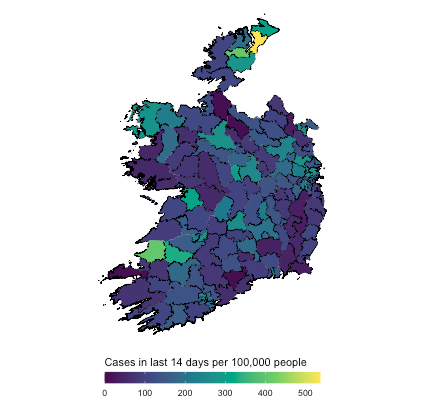
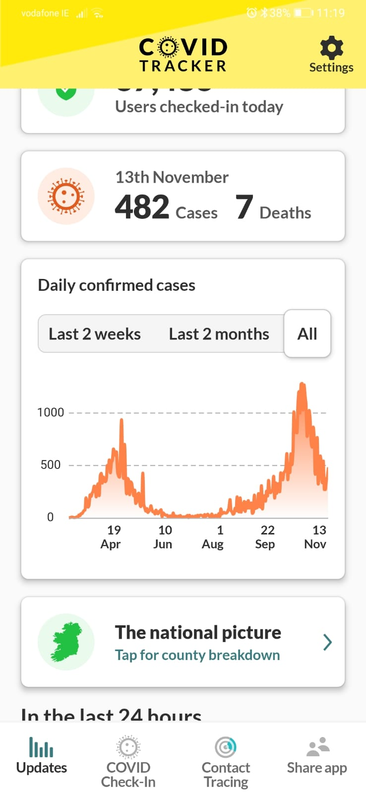

Many commenters have noted the salience of data visualization in the current Covid-19 crisis and its new-found popularity since March. While I think this is positive, the data scientist in me has been frustrated by some of the ideas and intent behind these visualizations as well as the understanding of dataviz. Some are mildly annoying because they are developed to sell stories as opposed to providing information and others are annoying because they're practically useless.

As for selling stories, that's the prerogative of media outlets and I have no problem with that. The Financial Times, for example, drew praise for their Covid graphs, deservedly. (And I believe the basic static plots are made in R with ggplot2, go FT!) Their main dataviz expert, John Burn-Murdoch, explains the motivations behind their visual choices in a video [here](https://www.ft.com/video/9a72a9d4-8db1-4615-8333-4b73ae3ddff8). For me, the use of absolute numbers only early on in the pandemic was extremely misleading, a point I'll return to below, but John justifies it by pointing to the story that they wanted to highlight, which was the shocking amount of cases and deaths in absolute numbers. That's perfectly defensible and I'm glad they took the time to explain their choices when many others didn't (they also tracked and explained changes to their charts, overall their dataviz is of an excellent standard). As with the fantastic resources from [Our World in Data](https://ourworldindata.org/coronavirus), they have since incorporated options to let users [explore the data](https://ig.ft.com/coronavirus-chart/?areas=usa&areas=gbr&areasRegional=usny&areasRegional=usca&areasRegional=usfl&areasRegional=ustx&byDate=0&cumulative=0&logScale=1&perMillion=0&values=deaths), and this is important.

While highlighting the absolute numbers brings home the crushing human cost of the novel coronavirus pandemic and is a compelling narrative, it isn't satisfying from a data science perspective -- we need context and are used to probing and exploring the data. Now, it's not the FT's job, or any of the other media outlets', to inform us scientifically[^1] about Covid. While I'm disappointed that more didn't do that, like I said, they are perfectly within their rights to look for the compelling story. One organization that _does_ have a responsibility to inform us in the least biased way possible is the government, and particularly in Ireland, I feel they really could have done better.

First of all, here is a screenshot of the Irish Government's Covid-19 [app](https://covidtracker.gov.ie/).

They've [open-sourced](https://github.com/HSEIreland/covid-tracker-app) it, which is great, but how is that visualization informative to somebody seeking to learn about the current state of affairs in Ireland regarding Covid-19? There are tables with numbers by county, which offer no historical context. The main visualization is of cases only, with no context on deaths or ICU admissions, neither does it have case broken down age group, something we know to be important. Many of us have been stressed and worried throughout this pandemic, and dataviz like this really doesn't help. This annoyed me so much that I felt compelled to make a Shiny app if only for my own sanity[^2]. You can play with it below (refresh the page if it is greyed out -- it's just been sitting idle while you've been reading 🙂 ). There are three tabs: one has an interactive map of Covid cases, deaths and ICU admissions per million for selected countries, another has a Covid case map of Ireland and the third has Covid cases in Ireland broken down by age. It is not an attempt at the most amazing dataviz ever, it's simply to keep myself informed.

<iframe
  src="https://robertmylesmcdonnell.shinyapps.io/covid/"
  width="1000"
  height="700"
></iframe>

So what do we learn from this? Firstly, we can see how the emphasis on case numbers hides a startling picture. Back in March, April and May, there was much talk that Italy, Spain, the UK and the US had seen the worse of the coronavirus by a long way. Among the countries I've selected, Belgium is the worst case, by far.

There was also a general perception that Ireland was dealing quite well with the coronavirus, certainly in comparison to Italy and the US, let's say, or even the UK. Select Ireland, Italy, the United States and the United Kingdom in the app above and you'll see Ireland had the **_worst_** performance in cases and deaths per million among these countries. It's close among the European countries, but reading the general media, you would have thought the US was much worse.
I certainly wasn't aware of Ireland's bad position until I explored Our World in Data's coronavirus data back in April. To the best of my knowledge, there was no general knowledge among Irish people that this was the case in Ireland, and I doubt it is widely known even now. Certainly, I haven't seen the Irish government admit anything about it.

When Ireland returned to Level 5 a few weeks ago, there was much dismay and disappointment throughout the country, and graphs of the case numbers (like the Covid Tracker app screenshot above) were commonly used to justify it. What was not common were similar graphs of deaths and ICU admissions, two key statistics that the public should have been informed of by the Irish Government. If we compare the first wave in Ireland to the second, we can see there is a radically different profile to the second, as was well-known. Deaths from Covid-19 never experienced a second wave, although ICU admissions started to rise and are still rising. My point here is not necessarily that moving to Level 5 was misguided, but that these figures and easy-to-understand dataviz were not part of the conversation. Judging by ICU admissions, there was certainly cause for caution, if not alarm, but deaths per million have a totally different profile to the earlier wave. We've seen how data visualization can inform, it's a pity it's also being used to obscure and cause alarm.

None of this is to say Covid isn't serious or we should "be like Sweden", whatever that means. I don't envy governments across the world having to make hard decisions, but I do wish that people were kept more informed by the governments who represent them. I had to go digging for this data and it took work to prepare it for the simple app you see above. I'm an experienced data scientist, so I can do this, but what about everybody else?

P.s. Nice Irish Covid-19 app [here](https://hamilton-institute.github.io/covid19ireland/) made by Maynooth University, if you're interested. Much more detailed than my little app.

[^1]: I'm saying 'scientifically' here to mean informing in the least biased way possible. Free of bias is impossible, of course.
[^2]: This app is _not_ an attempt at replacing something like the Covid Tracker app, or at bettering the dataviz mentioned earlier by the FT and Our World in Data. It's simply me trying to get all the information I wanted.
