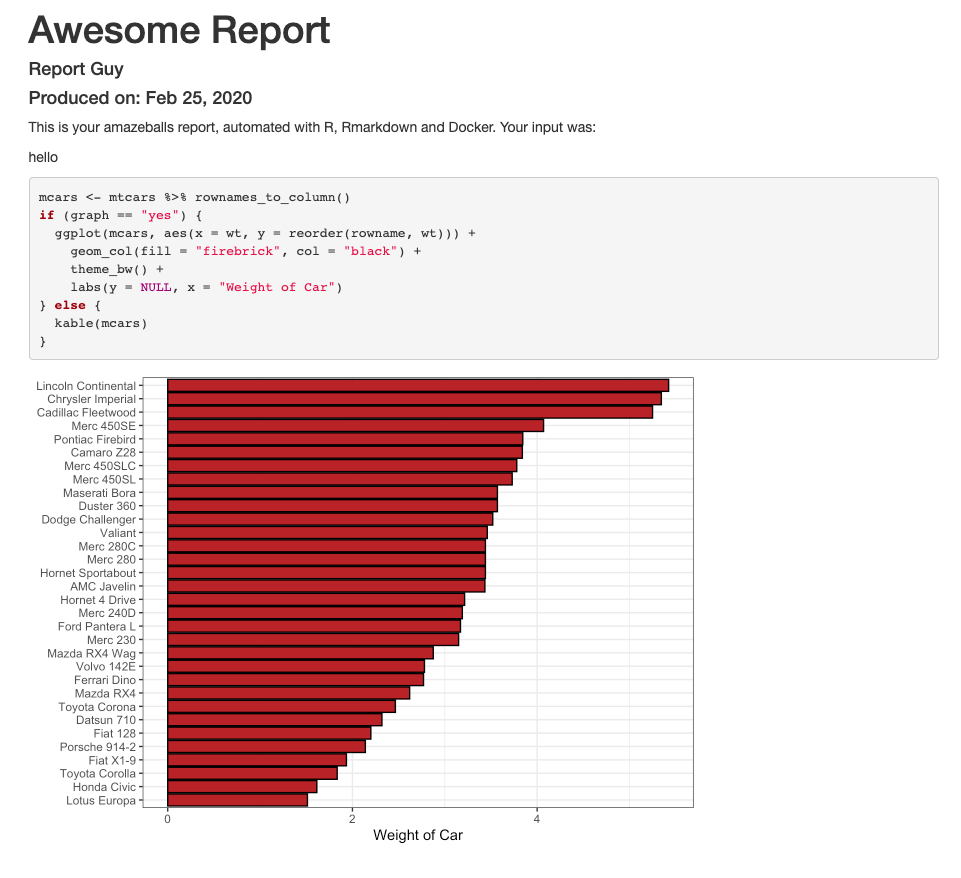
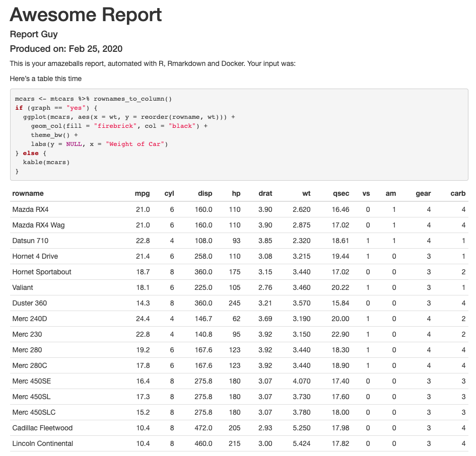

In this post, I'll go through a few examples of how you can use Docker for data science, from running a simple script to making reports. It's based on real usage, so I think there are a couple of things in there that are interesting. In fact, using Docker for data science involves some non-beginner uses of Docker -- sharing files between the host and the container, installing packages, connecting to databases etc -- and we'll go through these here. Of course, there are tons of posts and whatnot on using Docker with R or Python -- see [here](https://colinfay.me/docker-r-reproducibility/) for an intro with R (or [here](https://www.symbolix.com.au/blog-main/r-docker-hello)); [here](https://ropenscilabs.github.io/r-docker-tutorial/) for a more detailed piece, and [here](https://arxiv.org/abs/2001.10641) for a recently-published ArXiv paper that goes into detail on the state of Docker use with R. For Python users, since many come from computer science backgrounds, I assume you can already find the millions of posts on using Python with Docker 🤓. This post is approached from the R side of things, but plenty of it is applicable to Docker and Data Science more generally.

We'll start off simple and increase in complexity until we have a realistic example of how you can use Docker for thy data science needs. If you want to jump to the final section, <a href="#mainexample">off you go!</a>

We'll begin with a simple R script, then we'll share files between the container and the host. Then we will include some Python code, called from R. After that, we'll include some R packages and [renv](https://rstudio.github.io/renv/articles/renv.html), a package manager for R, and take advantage of its caching abilities, and see how we can use local (private) packages too. We will then include a database connection and set all that up. It's very possible you'd want to run something like this as a command line script, so we'll set it up as one, and see how we can pass in arguments to the Docker container. Last but not least, we'll see how we can share the container for use by someone else, or for putting on a remote server, quite a common use case. The R & Python scripts will be simple to keep focus on Docker.

First of all, let's get some terminology out of the way. The 'host' is your computer; we will build a docker _image_, and then from this image, we can run 'containers', which can be understood as _instances_ of the image. The Docker documentation is actually pretty good, you can access it [here](https://docs.docker.com/). We'll use [docker-compose](https://docs.docker.com/compose/), which is like a config file for your image, and the image itself is build from a _Dockerfile_. We won't use compose at the start but it will be useful later. We'll stick to some basic commands, but if you find yourself with a whole load of memory use, see [here](https://gist.github.com/bastman/5b57ddb3c11942094f8d0a97d461b430) for simple ways to clean up. I'm doing this on a Mac, but as far as I'm aware, things are pretty similar on Windows and Linux.

### Running a simple script

Ok, so make a new directory and go into it, and from there create a file: our first `Dockerfile` 👶. I'll include the code for this here, but from here on, I'll assume you know how to do this. If not, have a look [here](https://www.davidbaumgold.com/tutorials/command-line/), or just search on the web, there are tons of useful resources. On your command line:

```bash
mkdir simple && cd simple
touch Dockerfile
```

After this, we should have a folder with an empty file in it. Open up the Dockerfile in an editor you like. I like [VS Code](https://code.visualstudio.com/) for this type of thing. Place this in the file:

```Docker
FROM r-base:3.6.0
```

This sticks with a [simple base image](https://hub.docker.com/_/r-base) that will come with R already installed, but there are [many](https://www.rocker-project.org/) [others](https://github.com/rstudio/r-docker). We'll do something simple:

From your terminal/command line, you can now run:

```bash
docker build -t "simple" .
```

This will instruct Docker to build an image called "simple" (`-t` is a tag). You should see something like this:

```bash
docker build -t "simple" .
Sending build context to Docker daemon  2.048kB
Step 1/1 : FROM r-base:3.6.0
 ---> 876f4d7b60e9
Successfully built 876f4d7b60e9
Successfully tagged simple:latest
```

Now we can run it. We'll use `-it`, which makes the use of Docker interactive.

```bash
docker run -it simple
```

Whaddya know, we're in R in a container:

```bash
R version 3.6.0 (2019-04-26) -- "Planting of a Tree"
Copyright (C) 2019 The R Foundation for Statistical Computing
Platform: x86_64-pc-linux-gnu (64-bit)

R is free software and comes with ABSOLUTELY NO WARRANTY.
You are welcome to redistribute it under certain conditions.
Type 'license()' or 'licence()' for distribution details.

  Natural language support but running in an English locale

R is a collaborative project with many contributors.
Type 'contributors()' for more information and
'citation()' on how to cite R or R packages in publications.

Type 'demo()' for some demos, 'help()' for on-line help, or
'help.start()' for an HTML browser interface to help.
Type 'q()' to quit R.

>
```

You can play away to your heart's content.

Ok, that's nice, but not exactly compelling. Let's add some stuff to our Dockerfile to allow it to run an R script inside the container.

```docker
FROM r-base:3.6.0
WORKDIR /r_stuff
RUN touch little_script.R
RUN echo "print('hi, every-body!')" >> little_script.R
CMD ["Rscript", "little_script.R"]
```

So what does this do? We're now creating a working directory and entering it (`WORKDIR`), which is a cleaner way to operate (I've had problems doing things in the root folder of the container). Then we create a `little_script.R` file with `RUN touch` (`RUN` allows you to run a command). We send some text to this file, which is the R code `print('hi, every-body!')` (you can say this in a [Dr. Nick](https://simpsons.fandom.com/wiki/Nick_Riviera) voice). You can build it as before. Running this will give us:

```bash
docker run simple
[1] "hi, every-body!"
```

R users will recognize that familiar `[1]`.

Ok, let's clean up and move onto something a little more complex. `docker ps -a` will show us what containers we have running:

```bash
docker ps -a
CONTAINER ID        IMAGE               COMMAND                  CREATED             STATUS                         PORTS               NAMES
9889a905c62c        simple              "Rscript little_scri…"   2 minutes ago       Exited (0) 2 minutes ago                           magical_davinci
```

You can grab the `CONTAINER ID` and remove it:

```bash
docker rm 9889a905c62c
```

Let's remove our image too:

```bash
docker image ls
REPOSITORY             TAG                 IMAGE ID            CREATED             SIZE
simple                 latest              7452901b888b        9 minutes ago       644MB
```

```bash
docker rmi simple
```

You might have noticed that image was 644MB, so it's best to clean up images and containers you're not using. If you're trying this out, you'll probably build a few containers from an image. If you want to delete a few, but not just everything, just put the container ids one after another:

```bash
docker rm <CONTAINER ID> <CONTAINER ID> <CONTAINER ID> ...
```
Otherwise there are simple ways to remove everything you're not using, as linked to above. 

### Reading & Writing Files

This time we'll use docker-compose. Leave the simple directory, create a new one (mine's called 'readwrite'), and create three files: a Dockerfile, a file called `docker-compose.yml` and another called `input.txt`. In your Dockerfile, put:

```docker
FROM r-base:3.6.0
WORKDIR /main
CMD ["Rscript", "readwrite.R"]
```

In `docker-compose.yml`, put:

```yaml
version: "3.5"
services:
  readwrite:
    build:
      context: .
    volumes:
      - .:/main
```

And in `input.txt`, put: `Hi, every-body!` (continuing our temporary Simpson's theme) and hit return for a newline. The only thing we need to do now is write `readwrite.R`, which will be a little R script to read a text file and append some text to it before writing it out.

```r
infile <- readLines("input.txt")

outfile <- append(infile, "\nI'm Dr. Nick!")

writeLines(outfile, "output.txt")
```

What we're hoping will happen here is that the Docker container, when run, will use R to read in our input file and write out the expanded text. We're able to do this through the use of:

```yml
volumes:
  - .:/main
```

This allows us to map our folder (`.`) to the `main` folder inside the container -- the syntax is `host folder: container folder`.  
We'll use `docker-compose build` instead of `docker build .`:

```bash
docker-compose build
Building readwrite
Step 1/3 : FROM r-base:3.6.0
 ---> 876f4d7b60e9
Step 2/3 : WORKDIR /main
 ---> Running in 046bb8b83085
Removing intermediate container 046bb8b83085
 ---> f1fa9502a856
Step 3/3 : CMD ["Rscript", "readwrite.R"]
 ---> Running in 166e6004cc99
Removing intermediate container 166e6004cc99
 ---> 82d026f1e6f4

Successfully built 82d026f1e6f4
Successfully tagged readwrite_readwrite:latest
```

Now we run:

```bash
docker-compose run readwrite
Creating network "readwrite_default" with the default driver
```

Ok! If you open up `output.txt`, you should see:

```txt
Hi, every-body!

I'm Dr. Nick!

```

Nice.

### Including Python

Alrighty, then. We're keeping this super simple to show what's happening with Docker, but as you can imagine, it's straightforward to replace our R script with something a little more involved. While still sticking to simple scripts, let's add something done in Python. In a regular data science work environment, you might use both of these languages together, and probably some others (there are [Docker images](https://hub.docker.com/r/jupyter/datascience-notebook) with these already available). Similarly to before, exit this directory, clean up if you need to, make a new folder (I'll call it pyr) and create your Dockerfile and docker-compose.yml. We'll create two simple R files and another simple Python one. Here's the Dockerfile for this one:

```docker
FROM r-base:3.6.0
WORKDIR /main
RUN apt-get update \
    && apt-get -y install python3.7 \
    && apt -y install python3-pip
RUN pip3 install pandas==0.25.1
CMD ["Rscript", "rpy.R"]
```

If you're not familiar with all that `apt-` stuff, it's the **A**dvanced **P**ackage **T**ool for Debian and Ubuntu-based linux distributions ([have a look](<https://en.wikipedia.org/wiki/APT_(software)>)). We're using it to install Python 3.7 and pip, and with pip we install Pandas 0.25.1. Our `docker-compose.yml` is almost identical to the previous one (we're changing the name of the service):

```yaml
version: "3.5"
services:
  pyr:
    build:
      context: .
    volumes:
      - .:/main
```

Our Dockerfile is calling an Rscript, `rpy.R`. This is the contents of said file:

```r
write.csv(mtcars, "mtcars.csv")
system2("python3", "mtcars.py")
Sys.sleep(10)
source("pyr.R")
```

I'll get back to `Sys.sleep()` in a moment.
This file calls Python, through the use of `system2()` and then sources another R file. `mtcars.py` looks like this:

```python
import pandas as pd

mt = pd.read_csv("mtcars.csv")
mt.rename(columns={'Unnamed: 0':'cars'})
mt.to_csv("mtcars_py.csv")
```

...and `pyr.R` looks like this:

```r
mt <- read.csv("mtcars_py.csv", stringsAsFactors = FALSE)

print(head(mt))
```

As before, we can run `docker-compose build` and `docker-compose run pyr`. This one will take noticeably longer because we're installing Python and Pandas. So with all of these files, your `pyr` directory should look like this:

```bash
.
├── Dockerfile
├── docker-compose.yml
├── mtcars.csv
├── mtcars.py
├── pyr.R
└── rpy.R
```

What are we doing here? We're saving out the mtcars dataset to a csv with R, calling Python to change a column name with Pandas, and saving the result out to a new csv, which we then call back into R and print the `head()`. Are you likely to do this? No. Does it show a simple way to link R and Python in a Docker container? Yup 👽

Well, running `docker-compose run pyr` gives us:

```bash
  X              cars  mpg cyl disp  hp drat    wt  qsec vs am gear carb
1 0         Mazda RX4 21.0   6  160 110 3.90 2.620 16.46  0  1    4    4
2 1     Mazda RX4 Wag 21.0   6  160 110 3.90 2.875 17.02  0  1    4    4
3 2        Datsun 710 22.8   4  108  93 3.85 2.320 18.61  1  1    4    1
4 3    Hornet 4 Drive 21.4   6  258 110 3.08 3.215 19.44  1  0    3    1
5 4 Hornet Sportabout 18.7   8  360 175 3.15 3.440 17.02  0  0    3    2
6 5           Valiant 18.1   6  225 105 2.76 3.460 20.22  1  0    3    1
```

So it worked nicely. The rownames of mtcars were transformed into a column named `cars` by Pandas and then printed out by R.

A glance at our folder shows us that the file was written successfully:

```bash
.
├── Dockerfile
├── docker-compose.yml
├── mtcars.csv
├── mtcars.py
├── mtcars_py.csv
├── pyr.R
└── rpy.R
```

So about that `Sys.sleep()`...

### Including R packages

I included `Sys.sleep(10)` in the R script above because I wanted to make sure that Python had finished running, but this is obs _NOT_ a good way to do things. Let's see we wanted to monitor the Python process and only act when it was done or completed successfully. It's likely we would want the expanded capacities of a package like [processx](https://github.com/r-lib/processx) (`system2()` is supposed to be lightweight).

Installing R packages into a Docker container is quite straightforward. If you are installing only one or a small number of packages, you can add:

```docker
RUN R -e "install.packages('<PACKAGE>', repos = c(CRAN = 'https://cloud.r-project.org'))"
```

where `<PACKAGE>` is the name of the package. However, each one of these commands (`WORKDIR`, `RUN` etc.) create a _layer_ in the Docker container, and good practice is to keep these layers to a minimum (you saw how they're not small objects to have on your computer). So what can we do if we have a whole load of packages to install? One solution is to use renv. You could also throw them all into the `<PACKAGE>` part above, but renv is a nice tool for package management in general, so we'll go with that for now. L8Rz, I'll throw them all together. 

When using renv with Docker, I've found the best way to do things is to share the cache, which we will do through our `docker-compose.yml` file. First, let's get renv set up in another folder.

For reference, the complete documentation for renv can be found [here](https://rstudio.github.io/renv/index.html). Let's set up a new folder, initialize an [RStudio project](https://support.rstudio.com/hc/en-us/articles/200526207-Using-Projects) in it and initialize renv. Once you've got your project set up, install renv in R:

```r
install.packages('remotes')
remotes::install_github('rstudio/renv@0.9.2-31')
```

Once this is done, you can run this from R:

```r
renv::init()
```

This will set up renv for this project (folder). By default, renv uses a global cache. Let's stick to a project-specific cache, since we don't want to transfer anything over to our Docker container that we don't need. We'll use an environment variable for this. First, make a project-specific .Renviron file:

```bash
touch .Renviron
```

Now add the following line to it:

```bash
RENV_PATHS_CACHE = renv/cache
```

Restart your R session and now we'll have a local cache.

Ok, so now we can install a few R packages that we might use. Let's start with the aforementioned processx.

renv uses a lockfile in the style of [npm](https://nodejs.dev/the-package-lock-json-file) to keep track of what packages are used in a project (you can see the npm one used for this website [here](https://github.com/RobertMyles/site/blob/master/package-lock.json)). At this stage, it should just have the following entries:

```json
{
  "R": {
    "Version": "3.6.2",
    "Repositories": [
      {
        "Name": "CRAN",
        "URL": "https://cran.rstudio.com"
      }
    ]
  },
  "Packages": {
    "renv": {
      "Package": "renv",
      "Version": "0.9.2-28",
      "Source": "GitHub",
      "RemoteType": "github",
      "RemoteHost": "api.github.com",
      "RemoteRepo": "renv",
      "RemoteUsername": "rstudio",
      "RemoteRef": "master",
      "RemoteSha": "89248dcee7e3cc367de09fefee90cbd529d4b7cf",
      "Hash": "c07009d1397ccdc76280404cd85394b4"
    }
  }
}
```

We will use renv to install processx, and tibble for pretty printing. Since we're moving in the direction of a cli, let's install, well, [cli](https://github.com/r-lib/cli). For now, we'll just use it to make a spinner, but later it will form an important part of our appzinho. 

```r
renv::install("processx")
renv::install("tibble")
renv::install("cli")
```

This allows us to clean up our R scripts and monitor the Python process properly. Let's write a new R script called `r_processx.R`:

```r
library(processx)
library(cli)
library(tibble)

write.csv(mtcars, "mtcars.csv")

p <- process$new("python3", "mtcars.py")
sp <- make_spinner("bouncingBall")
while (p$is_alive()) {
  sp$spin()
  Sys.sleep(1)
}

mt <- read.csv("mtcars_py.csv", stringsAsFactors = FALSE)

print(head(mt))
```

This adds a process `p` that we can monitor (the `p$is_alive()` part) and a nice spinner that's cool. We call our Python script from before (you'll need to copy it over to this folder, it's the same one, `mtcars.py`), it hasn't changed. Let's run `renv::snapshot()`, which should show you this:

```r
> renv::snapshot()
The following package(s) will be updated in the lockfile:

# CRAN ===============================
- R6           [* -> 2.4.1]
- assertthat   [* -> 0.2.1]
- cli          [* -> 2.0.1]
- crayon       [* -> 1.3.4]
- digest       [* -> 0.6.23]
- ellipsis     [* -> 0.3.0]
- fansi        [* -> 0.4.1]
- glue         [* -> 1.3.1]
- pillar       [* -> 1.4.3]
- pkgconfig    [* -> 2.0.3]
- processx     [* -> 3.4.1]
- ps           [* -> 1.3.0]
- rlang        [* -> 0.4.4]
- tibble       [* -> 2.1.3]
- utf8         [* -> 1.1.4]
- vctrs        [* -> 0.2.2]

Do you want to proceed? [y/N]:
```

Hit `y` and renv will create a lockfile. Our docker-compose.yml will look like this:

```yaml
version: "3.5"
services:
  processx:
    build:
      context: .
    volumes:
      - .:/main
      - ./renv/cache/v5/R-3.6/x86_64-apple-darwin15.6.0:/main/renv/cache
```

You'll notice we're now sharing the renv cache across to the container. **This is also a _platform-specific_ path, so if you are on Windows or using a different version of R, you will need to change this.** How do you get this path? `renv:::renv_paths_cache()` will give it you, see [here](https://rstudio.github.io/renv/articles/docker.html).

Our Dockerfile also looks a little different:

```docker
FROM r-base:3.6.0
WORKDIR /main
RUN apt-get update \
    && apt-get -y install python3.7 \
    && apt -y install python3-pip
RUN pip3 install pandas==0.25.1
# renv and R packages
ENV RENV_VERSION 0.9.2-31
RUN echo "options(renv.consent = TRUE)" >> .Rprofile
COPY renv.lock .
RUN R -e "install.packages('remotes', repos = c(CRAN = 'https://cloud.r-project.org'))"
RUN R -e "remotes::install_github('rstudio/renv@${RENV_VERSION}')"
RUN R -e "renv::restore(confirm = FALSE)"
RUN R -e "renv::snapshot(confirm = FALSE)"
CMD ["Rscript", "r_processx.R"]
```

We're installing renv onto the image, passing in some renv options and using `restore()`, which will take our lockfile and 'restore' the renv environment according to it. First time around, this will take some time to build our library, but afterwards it is much quicker as we're taking advantage of renv's cache. We then use `snapshot()` to make sure that the lockfile is updated with the packages that we've just installed (we shouldn't really need to do this, but I've found it to be necessary).  
What else is new here? We create an environment variable with `ENV` (the version of renv we want). It's not strictly necessary, but makes the Dockerfile easier to read and maintain. We have two renv options to take care of too -- setting `renv.consent = TRUE` and making `confirm = FALSE` on `restore()` and `snapshot()`. Leaving `confirm = FALSE` out will make the Docker build hang as it's waiting for interactive input, which you won't be able to give. So sad.

You can build this as before, and you'll notice that it will use the lockfile to install our R packages. If you're curious about the cache, run `docker-compose build` again and you'll see that Docker uses it. You'll see something like:

```bash
Step 12/13 : RUN R -e "renv::restore(confirm = FALSE)"
 ---> Using cache
```

Great! 🤗
Ok, so after all this, we should have a directory that looks like this (I'm making these folder structure lists with [tree](https://sourabhbajaj.com/mac-setup/iTerm/tree.html), in case you haven't seen it before and were wondering. You probably weren't):

```bash
.
├── .Renviron
├── .Rprofile
├── .Rproj.user
├── Dockerfile
├── docker-compose.yml
├── mtcars.py
├── r_processx.R
├── renv
├── renv.lock
└── renvdocker.Rproj
```

So running this should show us the following:

```bash
docker-compose run processx
( ●    )  X              cars  mpg cyl disp  hp drat    wt  qsec vs am gear carb
1 0         Mazda RX4 21.0   6  160 110 3.90 2.620 16.46  0  1    4    4
2 1     Mazda RX4 Wag 21.0   6  160 110 3.90 2.875 17.02  0  1    4    4
3 2        Datsun 710 22.8   4  108  93 3.85 2.320 18.61  1  1    4    1
4 3    Hornet 4 Drive 21.4   6  258 110 3.08 3.215 19.44  1  0    3    1
5 4 Hornet Sportabout 18.7   8  360 175 3.15 3.440 17.02  0  0    3    2
6 5           Valiant 18.1   6  225 105 2.76 3.460 20.22  1  0    3    1
```

As you can see from this thing -- `( ● )` -- we enabled a spinner from processx and cli (the execution of the script is too quick to see our ball bounce around, but you get the idea). This is a toy example, but if you're calling Python from R in this way it's important to see what happens, especially in the case of errors. Monitoring the process with processx is a great way to do it. More to the point, this shows how we can a) include Python and R together; b) install R and Python packages; and c) use a package manager and cache for R.

### Package Management for Python

For Python, you can use `pip freeze > requirements.txt`, which is a common pattern for saving Python project dependencies. With the `COPY` command in your Dockerfile, you can copy your requirements text file from your host project folder over to the image and then use pip to install your packages from there. Nice and simple.

### Including local source packages for R

Another use case you might come across is that of having a local package, i.e. something that is not publicly available, perhaps an internal R package you use in-company or whatever. Since we're using renv, you may want to have a read [of this](https://rstudio.github.io/renv/articles/local-sources.html). You have a few options for how you go about this, but a relatively straightforward one is the following. Create a `local` folder inside of the `renv` directory:

```bash
renv
├── activate.R
├── cache
├── library
├── local
├── settings.dcf
└── staging
```

Copy the [built](https://devtools.r-lib.org/reference/build.html) package over into the `renv/local/` folder. In your Dockerfile, add a COPY command to copy the package over (with the name of your package in `<PACKAGE>`):

```docker
FROM r-base:3.6.0
WORKDIR /main
RUN apt-get update \
    && apt-get -y install python3.7 \
    && apt -y install python3-pip
RUN pip3 install pandas==0.25.1
# renv and R packages
ENV RENV_VERSION 0.9.2-31
RUN echo "options(renv.consent = TRUE)" >> .Rprofile
COPY renv.lock .
RUN R -e "install.packages('remotes', repos = c(CRAN = 'https://cloud.r-project.org'))"
RUN R -e "remotes::install_github('rstudio/renv@${RENV_VERSION}')"
# restore from copied lockfile
RUN R -e "renv::restore(confirm = FALSE)"
# Copy package
COPY renv/local/<PACKAGE>.tar.gz main/renv/local/<PACKAGE>.tar.gz
RUN R -e "renv::install('renv/local/<PACKAGE>')"
# record
RUN R -e "renv::snapshot(confirm = FALSE)"
CMD ["Rscript", "r_processx.R"]
```

You can set an environment variable for the local renv source, as we did earlier for `RENV_PATHS_CACHE`. It's `RENV_PATHS_LOCAL`, as can be seen by `renv:::renv_paths_local()`. I don't think this is strictly necessary. Maybe it should be. renv isn't yet v1, so that could change.

I've had a few problems with this part, so if you run into trouble, there are other ways to do it. You can do this in R code from when you run the container. It will install the packages first time around, but since we're using the renv cache, it will not do this a second time. Your `r_processx.R` could have something like this at the top:

```r
renv::restore()
x <- row.names(installed.packages())
if (!"<YOUR LOCAL PACKAGE>" %in% x) renv::install('<YOUR LOCAL PACKAGE>.tar.gz')
renv::snapshot(confirm = FALSE)
# continue with script...
```

If you do it through R, you will see this the second time you run the container:

```bash
docker-compose run processx
* The library is already synchronized with the lockfile.
* The lockfile is already up to date.
( ●    )  X              cars  mpg cyl disp  hp drat    wt  qsec vs am gear carb
1 0         Mazda RX4 21.0   6  160 110 3.90 2.620 16.46  0  1    4    4
2 1     Mazda RX4 Wag 21.0   6  160 110 3.90 2.875 17.02  0  1    4    4
3 2        Datsun 710 22.8   4  108  93 3.85 2.320 18.61  1  1    4    1
4 3    Hornet 4 Drive 21.4   6  258 110 3.08 3.215 19.44  1  0    3    1
5 4 Hornet Sportabout 18.7   8  360 175 3.15 3.440 17.02  0  0    3    2
6 5           Valiant 18.1   6  225 105 2.76 3.460 20.22  1  0    3    1
```

Meaning the local package was successfully installed and our code ran as before.

### System Dependencies

Depending on your local package, or indeed on the R/Python packages you install, you may need to add system dependencies. For example, if using the [magick](https://cran.r-project.org/web/packages/magick/vignettes/intro.html#build_from_source) package for R, you'll need to install the ImageMagick++ library (since the Docker container is Linux; for OSX and Windows, this comes with magick.) These dependencies need to be installed on the image. For the example of magick, this would be the following:

```docker
RUN apt-get update \
    && apt-get install -y --no-install-recommends \
    libmagick++-dev \
    && rm -rf /var/lib/apt/lists/*
```

You'll need to check package documentation for dependencies for different packages, but your Dockerfile shouldn't be much different from this example above.

### Database Connections

Another common use case it's that your R or Python scripts will first pull some data from a database. You have two options for setting this up. First, you can start with a database image. For example, this terminal command will download an Oracle image from [Docker Hub](https://hub.docker.com/_/oraclelinux/):

```bash
docker image pull oraclelinux:7-slim
```

Then you can build your R or Python layers on top of this.

Alternatively, you can add some extra lines to the type of Dockerfile we've already been using. Here I'll run through a quick Oracle example in another folder. This time we'll use [reticulate](https://rstudio.github.io/reticulate/) to connect R and Python. reticulate's great. 🐍

So again we're starting with an R base image, but this time we set up an Oracle-related working directory and download and install all the Oracle stuff we need. The only other changes from the type of thing we did before is an extra Python library, [cx_Oracle](https://cx-oracle.readthedocs.io/en/latest/) and that we install reticulate and ggplot2. You may need to set up reticulate, there's plenty of info [here](https://rstudio.github.io/reticulate/articles/versions.html). I chose to set the environment variable `RETICULATE_PYTHON="/usr/local/bin/python3"` in my global `.Renviron`, but how you do it is up to you.

```Docker
FROM r-base:3.6.0

# Oracle setup
WORKDIR /opt/oracle
RUN apt-get update && apt-get install -y libaio1 wget unzip \
    && wget https://download.oracle.com/otn_software/linux/instantclient/instantclient-basiclite-linuxx64.zip \
    && unzip instantclient-basiclite-linuxx64.zip \
    && rm -f instantclient-basiclite-linuxx64.zip \
    && cd /opt/oracle/instantclient* \
    && rm -f *jdbc* *occi* *mysql* *README *jar uidrvci genezi adrci \
    && echo /opt/oracle/instantclient* > /etc/ld.so.conf.d/oracle-instantclient.conf \
    && ldconfig

WORKDIR /main
COPY . /main
RUN apt-get update \
    && apt-get -y install python3.7 \
    && apt -y install python3-pip
RUN pip3 install pandas==0.25.1 \
    cx-Oracle==7.2.3 --trusted-host pypi.org --trusted-host files.pythonhosted.org
RUN R -e "install.packages(c('ggplot2', 'reticulate'))"

CMD ["Rscript", "db_connect.R"]
```

This is a toy example, since I'm not going to connect to a database here. But, filling in for your database credentials (password etc.), your `db_connect.R` could be something like this:

```r
library(reticulate)
library(ggplot2)

source_python("connect.py")
df <- give_me_data("url", "port number", "SID", "my_username", "my_password")

ggplot(df, aes(x = X, y = Y)) +
    geom_point()
```

Where the Python file, `connect.py`, sourced by reticulate, has this:

```python
import cx_Oracle
import pandas as pd

def give_me_data(URL, PORT, SID, USERNAME, PASSWORD):
    """
    Takes in args to make Data Source Name (DSN), then
    create an Orcale connection and read the data with
    Pandas.
    """
    dsn = cx_Oracle.makedsn(URL, PORT, SID)
    connection = cx_Oracle.connect(user=USERNAME, password=PASSWORD, dsn=dsn)
    df = pd.read_sql(sql=test_query, con=conn)
    return df

```

With all your DB credentials. Our docker-compose.yml is simple:

```yaml
version: "3.5"
services:
  dbconnect:
    build:
      context: .
    volumes:
      - .:/main
```

And you would build and run this as before, if you had a real database to connect to.  

<hr />

As you can see, there are lots of use cases for how you might want to use Docker for data science. The examples above are deliberately simple on the DS-side so that the use of Docker is clear. However, they're not so realistic, so let's build out an example which is. This is an RMarkdown report, run as a cli that you can schedule, and in a future post I'll describe how to Dockerise a machine learning model prediction service. Kewlz. Let's go! 🏄🏿‍♂️


## Complete Example -- Automated Report
<div id="mainexample">
I'll include all the code here so you can reproduce this yourself. Explanations will be minimal since we already went through that 👮‍♂️

Ok, let's get set up. We're not going to get mega-complex here, any of the extras you need, you should be able to use some of the examples above (including Python, local packages, DB connections etc.). We'll have one master RMarkdown file and a `main.R` file that will control all of the other things we do.

```bash
mkdir reporting && cd reporting
touch Dockerfile && touch docker-compose.yml
mkdir rmarkdown && mkdir R
touch rmarkdown/master.Rmd
touch R/main.R
```

Ok, let's see what we'd need for a realistic reporting app. We'll use cli to get a nice CLI and [optparse](https://github.com/trevorld/r-optparse) to parse command line options fed in. We'll need a logger, so I'll use [log4r](https://github.com/johnmyleswhite/log4r). I'll also use some [tidyverse](https://github.com/tidyverse) packages. Let's put all this in a `R/libraries.R` file so that `main.R` doesn't get cluttered up. Our project looks like this now:

```bash
tree
.
├── Dockerfile
├── R
│   ├── libraries.R
│   └── main.R
├── docker-compose.yml
├── reporting.Rproj
└── rmarkdown
    └── master.Rmd

2 directories, 6 files
```

`libraries.R` looks like this:

```r
library("dplyr")
library("ggplot2")
library("tibble")
library("rmarkdown")
library("log4r")
library("cli")
library("optparse")
library("knitr")
library("glue")
```

We'll create a few more things to get going. First, create a `reports/` folder in the project root, that's where we'll put our rendered reports. In our `R` folder, also create a `cmdargs.R`, which is where we'll parse the command line arguments that we'll pass to our script. `cmdargs.R` looks like this:

```r
parse_cmd_args <- function() {
  option_list <- list(
    make_option(
      c("-i", "--input"),
      type = "character",
      help = "The text inoput you'd like to see rendered",
      metavar = "character"
    ),
    make_option(
      c("-g", "--graph"),
      type = "character",
      default = "yes",
      help = "Would you like a graph? Or a table?",
      metavar = "character"
    )
  )

  opt_parser <- OptionParser(option_list = option_list)
  opt <- parse_args(opt_parser)

  return(opt)
}
```

We're going to allow the user to choose between a graph or a table in their output, and to put in some input that will be rendered as text. The graph is chosen by default.

Our RMarkdown file, `master.Rmd`, will produce a HTML page. It looks like this:

````markdown
---
title: "Awesome Report"
author: "Report Guy"
params:
  input: NULL
  graph: NULL
date: "Produced on: `r format(Sys.time(), '%b %d, %Y')`"
output: html_document
---

This is your amazeballs report, automated with R, RMarkdown and Docker. Your input was:

`r asis_output(input)`

```{r message=FALSE, warning=FALSE}
mcars <- mtcars %>% rownames_to_column()
if (graph == "yes") {
  asis_output("You asked for a graph! So here you go: ")
  ggplot(mcars, aes(x = wt, y = reorder(rowname, wt))) +
    geom_col(fill = "firebrick", col = "black") +
    theme_bw() +
    labs(y = NULL, x = "Weight of Car")
} else {
  asis_output("You wanted a table! So here you go: ")
  kable(mcars)
}
```
````

What's happening here? Well, with `params` in the YAML header, we're sending command line arguments to the document, which are our input and whether the user wants a graph or not (`"yes"` and `"no"`). `input` gets printed with `r asis_output(input)`, and the code chunk prints either a plot or a table.

All of this is called from `main.R`. This file contains the CLI code so our script will print some pretty output to the terminal as it's working, and it loads our other R files as well as calls the rendering of the RMarkdown file. The CLI stuff starts with `cli_` or it's a rule (I use an empty rule to get some blank space). Other than that, we're just sourcing files, parsing the command line arguments, logging anything of interest, and sending everything off to `render()` for RMarkdown to take care of it.

```r
#!/usr/bin/env Rscript
start <- Sys.time()
suppressWarnings(
  suppressMessages(
    suppressPackageStartupMessages(
      source("R/libraries.R")
    )
  )
)
source("R/cmdargs.R")

rule(line = " ")
rule(
  center = "Awesome Automated Report", col = "cyan",
  width = console_width()
)
rule(line = " ")
cli_text("{col_grey('Reports started at ')}{col_magenta(start)}.")

if (!dir.exists("logs/")) {
  dir.create("logs/")
}

log_file <- paste0("logs/awesome_report_", start, ".log")
logger <- logger("INFO", appenders = file_appender(log_file))
info(logger, glue("Reports started at {start}."))

cmdargs <- parse_cmd_args()
graph <- cmdargs$graph
input <- cmdargs$input

if (graph == "yes") {
  cli_text(col_green("You asked for a graph, so we'll make one!"))
  info(logger, "Graph chosen by user.")
} else {
  cli_text(col_green("You asked for a table, so we'll make one!"))
  info(logger, "Table chosen by user.")
}
rule(line = " ")
output_f <- glue("report_at_{start}.html")
param_list <- list(graph = graph, input = input)
cli_alert_info(col_cyan("Report generation started..."))

render(
  input = "rmarkdown/master.Rmd", output_format = "html_document",
  output_file = output_f, envir = new.env(),
  output_dir = glue("reports/"),
  quiet = TRUE, params = param_list
)

cli_alert_success(col_green("Reports finished!"))
rule(line = " ")
```

What does this look like when we run it? Since it's got `#!/usr/bin/env Rscript` at the top, we can run this from the terminal with `Rscript` and supply our arguments with `--`:

```bash
$ Rscript R/main.R --input="hello" --graph="yes"

──────────────────────────────────── Awesome Automated Report ───────────────────────────────────────

Reports started at 2020-02-25 10:53:21.
You asked for a graph, so we'll make one!

ℹ Report generation started...
✓ Reports finished!
```

Great 👻. You can't see the nice colours here, but they'll render in your local terminal 👨🏼‍🎨.

Our log file was written successfully, it has this in it, for no input and `graph="no"`:

```log
INFO  [2020-02-25 12:06:38] Reports started at 2020-02-25 12:06:37.
INFO  [2020-02-25 12:06:38] Table chosen by user.
```

What does the actual HTML look like? For when the user passes in `--input="hello"` and `graph="yes"`, it looks like this:



And for when we pass in `"Here's a table this time"` as input and `graph="no"` (the table continues below the cutoff):



Very nice! Ok, it says "automated with R, RMarkdown and _Docker_", so let's get to the Docker part.

Our Dockerfile is as follows:

```docker
FROM r-base:3.6.0

WORKDIR /main
COPY . /main

RUN apt-get update \
    && apt-get install -y --no-install-recommends \
    pandoc \
    && rm -rf /var/lib/apt/lists/*

RUN R -e "install.packages(c('dplyr', 'ggplot2', 'optparse', 'knitr', 'cli', 'knitr', 'rmarkdown', 'log4r'), repos = 'http://cran.rstudio.com/')"

ENTRYPOINT ["Rscript", "R/main.R"]
```

...with our docker-compose.yml as:

```yaml
version: "3.5"
services:
  report:
    build:
      context: .
    volumes:
      - .:/main
```

We can build it with `docker-compose build` (actually, this takes quite a while, using a tidyverse R Docker image is probably a better idea here) and run it with `docker-compose run report`. What do we get?

```bash
─────────────────────────── Awesome Automated Report ───────────────────────────

Reports started at 2020-02-25 22:43:13.
You asked for a graph, so we'll make one!

ℹ Report generation started...
✔ Reports finished!
```

Since we supplied no arguments, we got a report with a graph, you can check it out in your `reports/` folder. We can supply arguments:

```bash
docker-compose run report --graph="no"

─────────────────────────── Awesome Automated Report ───────────────────────────

Reports started at 2020-02-25 22:47:50.
You asked for a table, so we'll make one!

ℹ Report generation started...
✔ Reports finished!
```

...aaaand a nice report appears in the appropriate folder with a table in it.

These are obviously minimal reports, but all of the infrastructure is here to build as complicated a (static) report as you could wish with RMarkdown. Go at it! 🚀
</div>

## Sharing the Docker Image

Now that you've got a program that runs inside of a Docker image, you have a few options for sharing it. You can just copy the project folder over to wherever -- a remote server, for example -- and build the Docker image from the Dockerfile there. Or you can just save it and load it again. Much easier. 

You save the Docker image to a tarball as so: 

```bash
docker save reporting_report > reports.tar
```

You then transfer this file over to wherever you need to run from. From this location, run: 

```bash
docker load < reports.tar
```

Now this can be run from the other location with `docker-compose run reports` as before. You can schedule it with [Airflow](https://www.shizidushu.com/2019/03/03/schedule-r-script-with-docker-and-airflow/), for example.   

<br/>
Aaalright, hope this was helpful! Take it easy now 🐶

