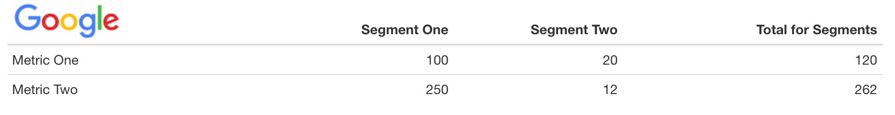
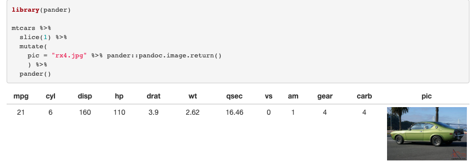

Have you ever wanted to include an image as a column header in a data frame? Of course you have!

All joking aside, this is actually surprisingly common in corporate environments, where tables may have the company logo in the header, probably as the first ‘column’. You can actually do this in Rmarkdown, with a little help from [rlang](https://rlang.r-lib.org/), [tibble](https://tibble.tidyverse.org/) [knitr](https://yihui.org/knitr/) and [pander](https://www.r-project.org/nosvn/pandoc/pander.html). Here’s how.

I’m going to use Google’s logo cos I’m sure they wouldn’t mind. You need to download a copy of this and you'll need to size it to fit your table. The image below is 115x40 (width x height).

First, load libraries and read in the image with pander:

```r
library(pander)
library(knitr)
library(rlang)
library(tibble)
library(magrittr) # fo' da pipe

img <- "google_logo.png" %>% pander::pandoc.image.return()
```

You’ll notice this is just markdown: `img` is `""`. Ok, rlang, pander and knitr magic coming up 🧙‍♀️. The code we’ll use is the following:

```r
tibble(
  {{ img }} := c("Metric One", "Metric Two"),
  `Segment One` = c(100, 250),
  `Segment Two` = c(20, 12)
  ) %>%
  pandoc.table(
    justify = c("left", "right", "right"),
    keep.line.breaks = TRUE
  )
```

Where `{{ img }}` uses [curly-curly](https://www.tidyverse.org/blog/2019/06/rlang-0-4-0/) and the [walrus](https://rlang.r-lib.org/reference/quasiquotation.html#forcing-names) operator to access the image variable we’ve created. It gets rendered as markdown thanks to pander’s `pandoc.table()` and knitr helps with code chunk options. Importantly, these need to include `results = 'asis'`. So it’ll look like this, minus the `#`:

````bash
#```{r results='asis'}
# amazing code...
#```
````

So, putting all this together, we get:

```r
tibble(
  {{ img }} := c("Metric One", "Metric Two"),
  `Segment One` = c(100, 250),
  `Segment Two` = c(20, 12),
  `Total for Segments` = c(120, 262)
  ) %>%
  pandoc.table(
    justify = c("left", "right", "right", "right"),
    keep.line.breaks = TRUE
  )
```

<br />
<table>
  <colgroup>
    <col style="width: 31%" />
    <col style="width: 19%" />
    <col style="width: 19%" />
    <col style="width: 29%" />
  </colgroup>
  <thead>
    <tr class="header">
      <th style="text-align: left;">
        
      </th>
      <th style="text-align: right;">Segment One</th>
      <th style="text-align: right;">Segment Two</th>
      <th style="text-align: right;">Total for Segments</th>
    </tr>
  </thead>
  <tbody>
    <tr class="odd">
      <td style="text-align: left;">Metric One</td>
      <td style="text-align: right;">100</td>
      <td style="text-align: right;">20</td>
      <td style="text-align: right;">120</td>
    </tr>
    <tr class="even">
      <td style="text-align: left;">Metric Two</td>
      <td style="text-align: right;">250</td>
      <td style="text-align: right;">12</td>
      <td style="text-align: right;">262</td>
    </tr>
  </tbody>
</table>
<br />
Now that’s a nice table 😍. And so easy! Keep in mind the styling here is basic, but knitting this in RStudio gives me:



Now _that's_ a nice table.

<br />
<br />

You're not limited to tables by the way. Have a look at my Stack Overflow answer [here](https://stackoverflow.com/questions/50108763/how-to-insert-images-into-table-in-r-markdown/58977352#58977352) that shows how easy it is to use images in the table cells. Long story short:


