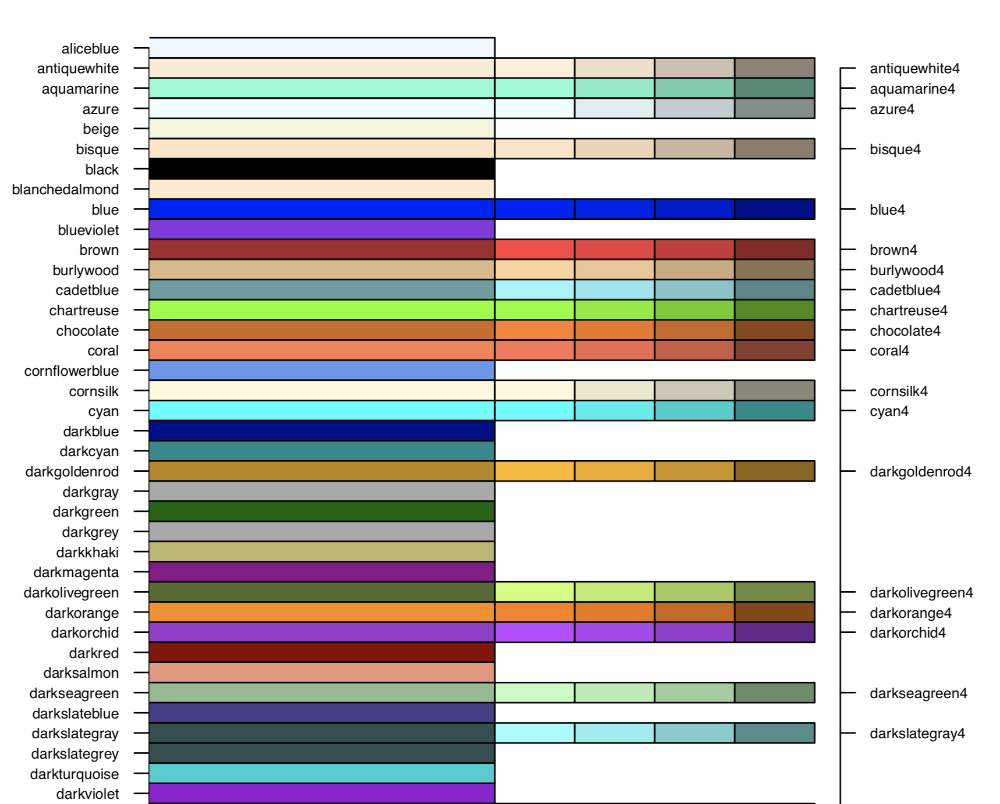
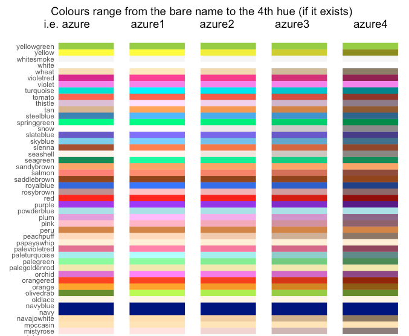
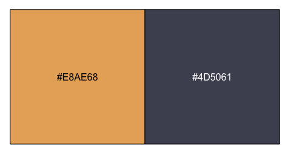
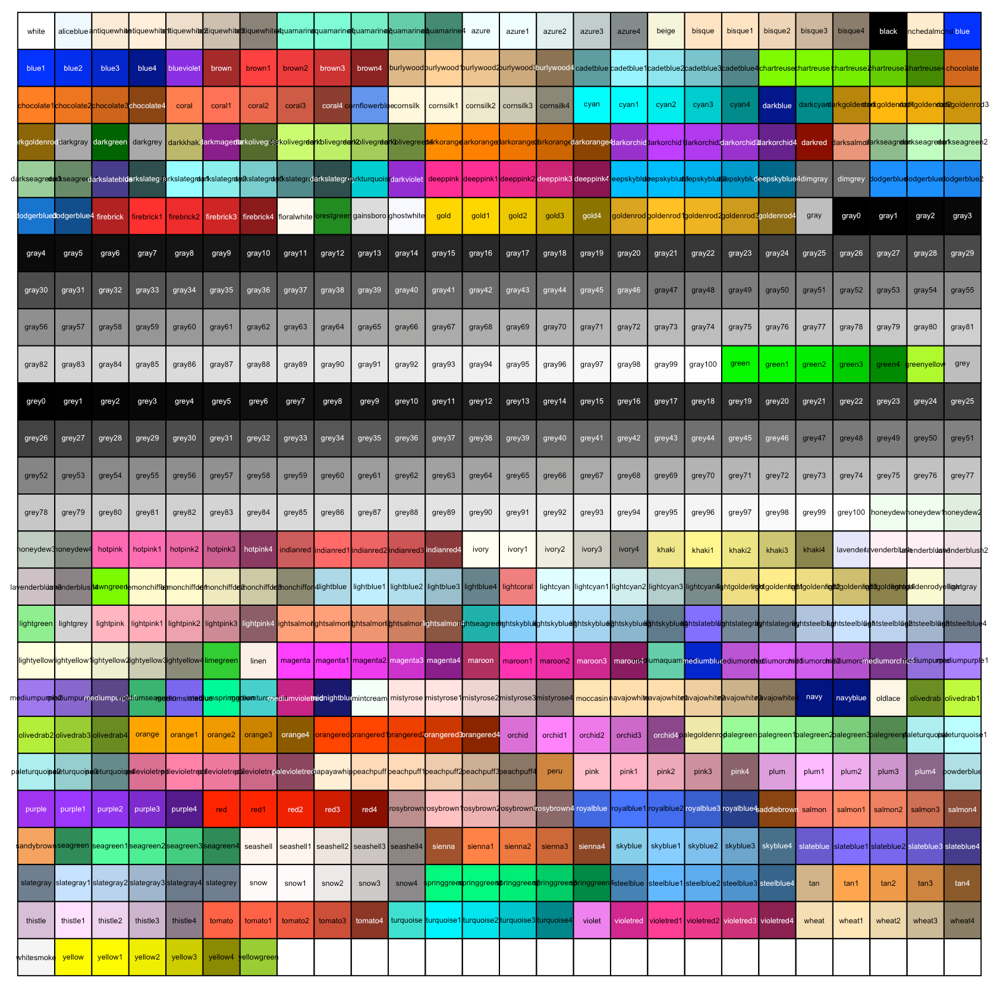

Some years ago, I came across a [great little repo](https://github.com/hdugan/rColorTable) that contained R code to display all the colours available in R. You can source it as so:

```r
source("https://raw.githubusercontent.com/hdugan/rColorTable/master/rColorTable.R")
```

It creates a two-page PDF that looks like this:



Super nice.

Back then, I thought it would be cool to see how to this with ggplot2, so I wrote a script that does that, you can see it [here](https://github.com/RobertMyles/sweet_R_tricks#colours-art). It prints a plot that looks like this:



Lovely. You have to love those names…‘mistyrose’, ‘whitesmoke’…so nice. 👨‍🎨

Anyway, I recently wanted to show the colours for a specific palette in the R console and I thought that there must be something new in the R universe to make this simpler, so after a little research, I realised the [scales](https://github.com/r-lib/scales) package has a lovely function, `show_col()`, which does exactly what I needed. I was comparing the colours `#E8AE68` and `#4D5061`, which we can do easily:

```r
scales::show_col(c("#E8AE68", "#4D5061"))
```



Fantabulous 🎨

Then I thought, this could be one-line replacement for all that code I used to use to see all the R colours! Which it is:

```r
scales::show_col(colours(), cex_label = .35)
```



Wowzers. You might have to mess with the `cex_label` parameter to get it juuuust right, but that’s not bad for one line of code. 👌
