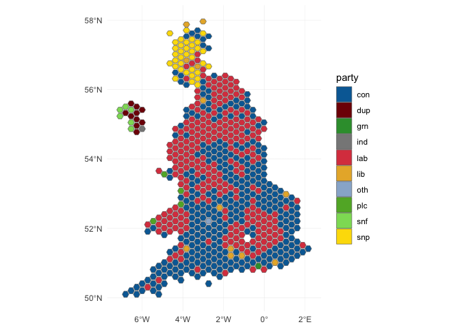

This post is a quickie to show how we can visualize the UK election results with just a few lines of R code. (Really, very few). [^1]

We can load in our usual tidyverse tools, along with a handy little data package, [parlitools](https://github.com/EvanOdell/parlitools).

```r
library(readr)
library(dplyr)
library(ggplot2)
library(parlitools)
library(sf)
```

Thanks to [this R Bloggers post](https://www.r-bloggers.com/uk-2017-general-election-results-data/), we have the data (the UK Electoral Commission must have it up by now anyway), so visualizing it is very easy:

```r
results <- read_csv("/Users/robert/Downloads/EconomistUK2017.csv")

uk <- west_hex_map

res <- inner_join(results, uk, by = c("Constituency.ID" = "gss_code")) %>%
  filter(!is.na(win)) %>%
  st_as_sf()


ggplot(res) +
  geom_sf(aes(fill = win), size = 0.2) +
  theme_minimal() +
  guides(fill = guide_legend(title = "party")) +
  scale_fill_manual(values = c("#006BA4", "#800B05", "#349B3A", "#888888", "#DB434E",
                    "#E8B335", "#98B3D1", "#60B031", "#8DDC64","#FCDD02"))
```



Bam! Easy, quick and lovely 😄.

[^1]: I’m using the dev version of ggplot2 here, we need it for `geom_sf()`.
