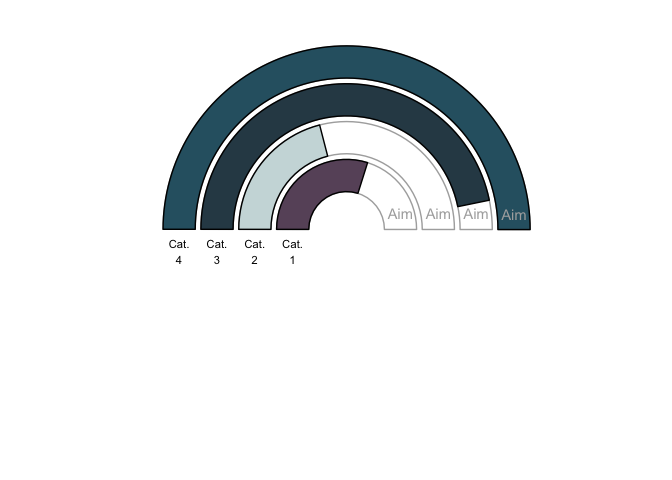
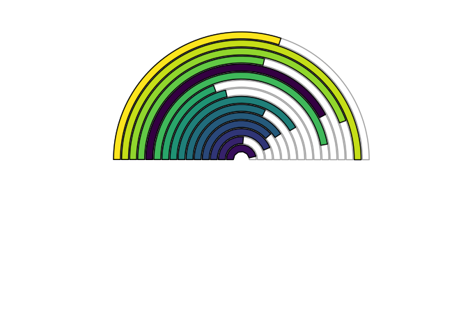

I've been working on a project where the client wanted a "cockpit" style dashboard, with meter/gauge/speedometer type things. Even though this wasn't likely to be implemented in R for the final version, I started thinking about how I could do this with ggplot2, influenced by some code from [here](http://www.r-graph-gallery.com/80-circular-barplot/). Base R graphics are likely a much better fit for something like this, as [Gaston Sanchez's example](http://www.gastonsanchez.com/visually-enforced/how-to/2013/01/10/Gauge-Chart-in-R/) shows, but I actually quite like the result with ggplot2. It's not so speedometery, so that's a good thing in my book. Anywayz, here is what it looks like, with how I did it to follow:

<!-- -->

So, it's not very generalizable by nature, since labels for each bar start to get difficult with more than three or four categories, so I recommend doing this with just that low number of bars. You could go wild, of course, but then the labels are better off of the plot, and the bars start to lose their smooth lines. I've used viridis for this, but it gives the false impression of a changing scale moving through the radius, so it's better to sample these colours from a palette or do it manually.

<!-- -->

So here's the code to do the first plot (the colours are sampled, so running this you'll get different ones). The trick involves using a transparent bars that go to 100, and a second set that go to 50.

```r
library(dplyr)
library(ggplot2)
library(scales)

# example data:
df <- data_frame(group = c("Cat. 1", "Cat. 2", "Cat. 3", "Cat. 4"),
                 value = sample(20:70, 4))

# scale everything and set labels:
df <- df %>%
  filter(!is.na(group)) %>%
  mutate(group2 = gsub(" ", "\n", group),
         group = ifelse(toupper(group) == "A", "Temp@", group)) %>%
  add_row(group = "A", value = 0, .before = 1) %>%
  mutate(value_scale = rescale(value, to = c(0, 100)),
         value_sc_half = rescale(value_scale, to = c(0, 50)),
         aim = rep(50, nrow(.)))

df_sub <- filter(df, group != "A")

# colours:
col_vec <- c("#440154FF", "#404788FF", "#2D708EFF", "#29AF7FFF",
             "#55C667FF","#2E6171", "#685369", "#191D32")

# graph
ggplot(df, aes(x = group, fill = group)) +
  geom_bar(width = 0.85, stat="identity", aes(y = value_scale),
           colour = "white", fill = "white") +
  geom_bar(data = df_sub, aes(y = aim), width = 0.85,
           stat = "identity", fill = "white", colour = "grey68") +
  geom_bar(data = df_sub, width = 0.85, stat = "identity",
           aes(y = value_sc_half, fill = group2), colour = "black") +
  coord_polar(theta = "y", start = -1.57) +
  theme_classic() +
  xlab("") + ylab("") +
  theme(legend.position = "none") +
  geom_text(data = df_sub, vjust = 1.4, size = 3,
           aes(x = group, y = 0, label = group2)) +
  geom_text(data = df_sub, aes(x = group, y = 50), label = "Aim",
            colour = "grey68", vjust = -1) +
  scale_fill_manual(values = sample(col_vec)) +
  theme(axis.text = element_blank(),
        axis.ticks = element_blank(),
        axis.line = element_blank(),
        plot.margin = margin(t = 0, r = 0, b = 0, l = 0, unit = "pt"))
```
